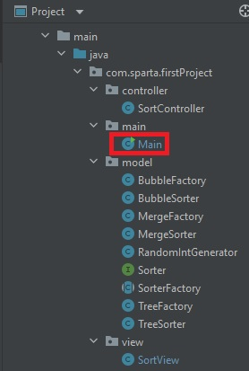
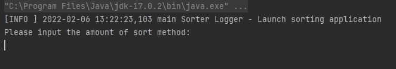
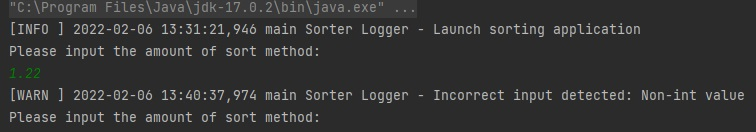
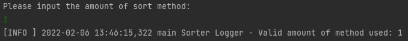
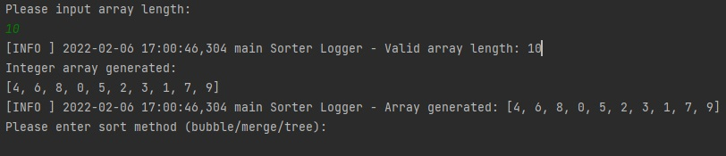
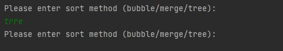
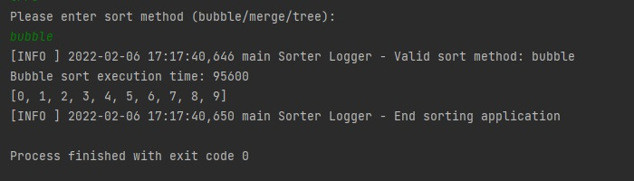

# FirstProject - Sorting Application

First Project @Sparta Global Training

By Ben Wong

## Introduction:

This is a simple integer array generator & sorting application. 

By inputting the minimum value, the maximum value, and the array length, you can generate a random integer array without duplicate numbers, then sort them with the chosen sorting method. 

You can also get the execution time for referencing the efficiency of each method.

## User Guideline:

1) You can launch the application using **_Main class_**

2) After running the main method, you should see the below message appeared:

   
   
You can input how many sort methods you want in a single run.

**IMPORTANT**: 
- Only integers are acceptable for any number input in this application

_If your input is invalid, you will be able to input again:_

_If your input is valid, you will see the INFO log as below:_

4) Then follow the instructions to input the ***Minimum value***, ***Maximum value***, and ***Array length***

**IMPORTANT**:

- ***Maximum value*** should larger than ***Minimum value***

- **_Array length_** shouldn't larger than (***Maximum value*** - ***Minimum value*** +1)

5) After inputting a valid array length, you should get a random sorted array.

_Example:_

minValue: 0

maxValue: 9

arrayLength: 10

6) Then you can input the sort method you want (bubble/merge/tree):

**IMPORTANT**:

According to the number of methods you have input at the beginning, 
you could select multiple sort methods in a single run.

_If your input is invalid, you will be able to input again:_

7) Finally, you can get the execution time, sort results, and the end message.

**IMPORTANT**: 

- Merge sort may have multiple execution time, the bottom one will be the final result.

## Testing:

- BubbleSorter
- MergeSorter
- TreeSorter
- RandomIntGenerator

## Logging:

The application contains 3 different levels of logging: 

- Debug: user input & sorting process information 

- Info: general information 

- Warn: Invalid input 

The default logger level is Info, you can change the logger level in log4j2.properties

Log information stored in sorterApplication.log

## Phase 1-5 Tasks check

###**Phase 1:**

Write a program which will take an array of ints and sort it using a bubble sort algorithm and then a merge sort algorithm. Include JUnit tests for this and all subsequent phases (and all subsequent projects for the rest of time).

Created:

- BubbleSorter

- BubbleSorterTest

- MergeSorter

- MergeSorterTest

- RandomIntGenerator

###**Phase 2:**

Update your project to use MVC and start to incorporate some of the design principles discussed earlier in the course (OOP, SOLID, design patterns). Create classes which implements MVC, including SortManager (controller) and a DisplayManager (view) classes. The code should include a basic factory pattern to determine which sorter to use. Make sure packages are created properly and the structure follows the MVC pattern. Create an interface which both sort classes can implement and make sure your application uses this interface where possible.

Created:

Model:
- Sorter (interface)
- BubbleFactory
- BubbleSorter
- MergeFactory
- MergeSorter
- RandomIntGenerator

View:
- SortView

Controller:
- SortController

###**Phase 3:**

Add logging code into the Sort Manager project. Set up log4j in the project and add a properties file. Create logs at different levels and fully test the resulting output. Have output going to the console and to a log file created in the resources directory. Ensure there are meaningful log messages added to the project and that they reflect the needs of the levels for which they are set.

Created:

- log4j2.properties

3 level of logger:

- Debug: user input & sorting process information

- Info: general information included application start & end

- Warn: Invalid input

###**Phase 4:**

Integrate a new class to implement a binary search tree approach for sorting, so that the BST can be called in the same way as the other sort algorithms. The new class should implement the current Sorter interface. Add code that calls the BST and passes in the array that will be used to construct the tree and then return a sorted array. Use the Facade design pattern for this step and implement a nested class to represent a node in the tree.

Created:

- TreeFactory
- TreeSorter

###**Phase 5:**

Add timing information to the project and allow the user to select multiple algorithms to compare their performance.

- Using System.nanoTime() in each sorter classes
- Using clone method to make sure 3 sorter method won't share the same array
- Using arrays to 